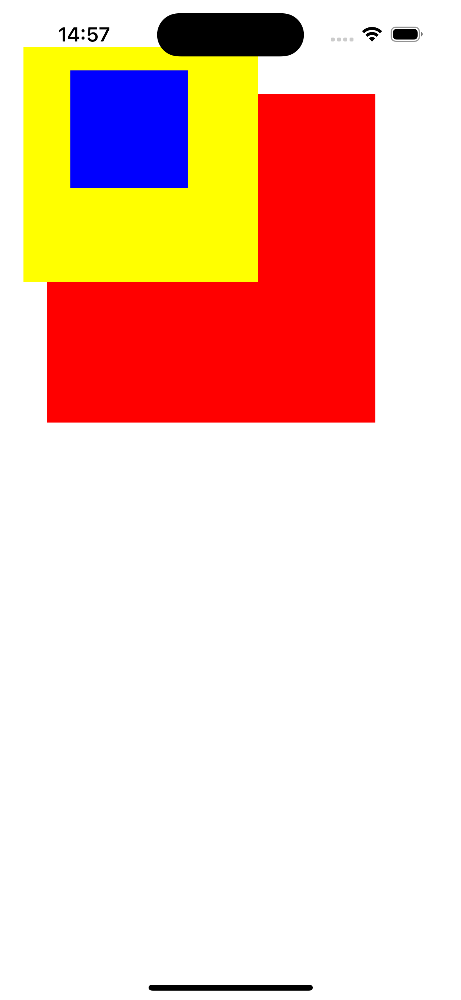

# 📱 iOS UIView 视图

##  UIView视图的基本使用

UIView 是 iOS 开发中最基础的视图组件，所有可视化控件（如按钮、标签）都继承自 UIView。以下是创建简单 UIView 视图的完整代码，包含位置、大小、背景色设置及父视图添加操作。

```swift
// 1. 定义视图的位置和大小（通过CGRect矩形区域）
// x: 距离父视图左侧30pt，y: 距离父视图顶部50pt
// width: 视图宽度250pt，height: 视图高度250pt
let rect1 = CGRect(x: 30, y: 50, width: 250, height: 250) 

// 2. 创建UIView实例，通过frame属性设置其位置和大小
// 核心说明：frame的坐标原点（x:0, y:0）默认对应父视图的左上角
// 若当前父视图为self.view（控制器根视图），则对应屏幕左上角
let view1 = UIView(frame: rect1) 

// 补充：frame与bounds核心区别（基础认知）
// frame：控制视图在父视图中的位置和大小（相对父视图）
// bounds：控制视图自身内部的坐标原点（相对自身）

// 3. 设置视图的背景颜色（此处设为棕色，可自由替换）
view1.backgroundColor = UIColor.brown 

// 4. 将创建的view1添加到当前控制器的根视图（self.view）
// 关键：只有将子视图添加到父视图，子视图才会在屏幕上显示
self.view.addSubview(view1)
```

### 核心知识点说明

- **CGRect**：iOS 布局基础，用于精准定义视图的位置（x,y）和尺寸（width,height），所有视图的布局都依赖此结构。

- **frame**：UIView 核心布局属性，决定视图在父视图中的位置和大小，坐标原点默认对齐父视图左上角。

- **addSubview**：子视图添加到父视图的核心方法，添加后子视图会显示在父视图上层，未添加则不会在屏幕上呈现。

- **UIColor**：用于设置视图背景色，支持系统自带颜色（如 .red、.blue、.white），也可通过 RGB 自定义颜色。

---

##  UIView视图的层次关系

当多个视图叠加时，会形成视图层次结构。子视图添加到父视图后，其坐标、显示优先级均受父视图影响，结合 frame 和 bounds 属性可实现复杂布局。以下代码演示多视图层次关系及 bounds 属性的实际应用。

```swift
// 1. 创建红色视图（父视图之一，直接添加到控制器根视图）
let view1 = UIView(frame: CGRect(x: 40, y: 80, width: 280, height: 280))
view1.backgroundColor = UIColor.red
self.view.addSubview(view1) // 添加到根视图，作为独立父视图

// 2. 创建黄色视图（父视图之二，直接添加到控制器根视图）
let view2 = UIView(frame: CGRect(x: 20, y: 40, width: 200, height: 200))
// bounds 核心用法：修改视图自身内部的坐标原点（相对自身）
// x:-40、y:-20 表示将自身内部原点向左移动40pt、向上移动20pt
view2.bounds = CGRect(x: -40, y: -20, width: 200, height: 200)
view2.backgroundColor = UIColor.yellow
self.view.addSubview(view2) // 添加到根视图，与view1同级

// 3. 创建蓝色视图（子视图，添加到黄色视图view2中）
let view3 = UIView(frame: CGRect(x: 0, y: 0, width: 100, height: 100))
view3.backgroundColor = UIColor.blue
view2.addSubview(view3) // 子视图添加到view2，其坐标相对view2的内部坐标系
```

### 层次关系核心要点

- **同级视图**：view1 和 view2 均直接添加到 self.view（根视图），属于同级视图，显示优先级由添加顺序决定（后添加的视图在上方）。

- **父子视图**：view3 添加到 view2 中，view2 是 view3 的父视图，view3 是 view2 的子视图；view3 的 frame 坐标相对于 view2 的内部坐标系（受 view2 的 bounds 影响）。

- **bounds 影响**：view2 的 bounds 原点设为 (-40, -20)，导致其内部坐标系偏移，因此 view3（frame: (0,0,...)）实际在屏幕上的位置会向右偏移40pt、向下偏移20pt。

 

