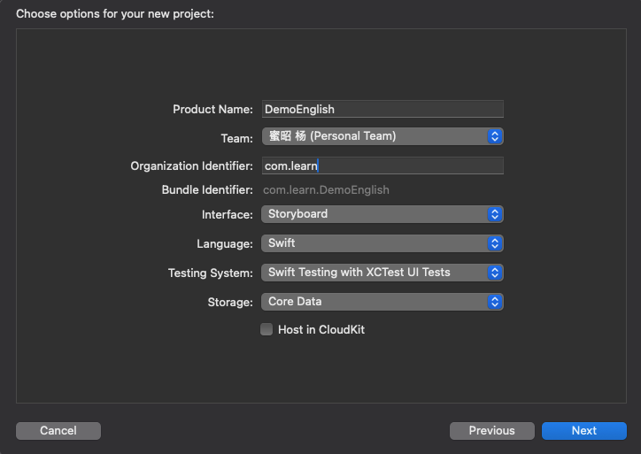

# 🎯 欢迎来到我的ios学习技术博客！

我是正在学习 iOS 开发的新手，这里记录我的每一步成长。

## 📚  《ios项目模版介绍》

- App **应用程序模版**
创建空白项目。

- Document App **文档应用模版**
用来创建基于文档的应用程序。

- Game **游戏框架模版**
主要用来开发二维游戏。目前已经支持的内容包括：场景、精灵、很酷的特效。并且还集成了物理库等许多内容。

- Augmented Reality App **增强现实模版**
用开快速搭建和增强现实相关的应用程序，并提供默认的三维场景。

- App Playground **其项目清单及源文件**
完全包括在扩展名为 `*.swiftpm` 的包中，基于SwiftUI，由Swift包管理器支持。

- Sticker Pack App 该模版可以将一组**表情图片**
在多行多列上进行排列，允许用户和朋友交流时，发送表情贴纸。

- iMessage App **消息应用模版**
可以使用完整的框架和原生的消息应用进行交互。可以在消息应用内，显示一个自定义的交互界面，甚至创建自定义的表情包。

- Safari Extension App **Safari应用程序扩展**  
为应用程序引入Safari，来帮助扩展Web浏览体验。

### 📚  《APP 创建项目》
- Product Name: **应用名称**
- Team: **苹果账号**
- Organization Identifier: **组织标志符**，是组织或公司的唯一标识，和上方应用名称共同组成产品的 Bundle Identifier。
- Interface: **用户界面类型列表**，提供两种用户界面搭建技术SwiftUI、Storyboard，采用默认Storyboard。
- Language: **系统预设语言选项列表**，两种语言 Swift、Objective-C。
- Testing System: **测试系统**， XCTest是Apple提供的测试框架，支持多种测试类型，包括单元测试、UI和性能测试。UI Tests用于自动测试用户界面和交互。
- Storage: **数据存储**，需要保存大量数据选择数据存储和管理框架Core Data。

