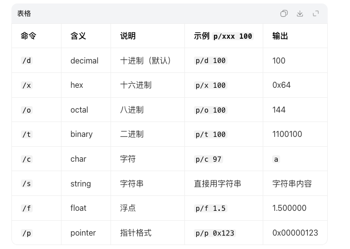

# 📱 iOS LLDB 调试

## 一、什么是 LLDB？

LLDB = 苹果官方自带的高性能调试器

- 配合 Xcode 使用

- 作用：暂停程序 → 查看变量 → 修改值 → 排查 bug

- 是 iOS / macOS 开发必备调试工具

- 代码断点 + LLDB 命令 = 最强调试组合

## 二、怎么使用 LLDB？

1. 在代码行号左边 点一下 → 出现蓝色断点

2. 运行程序，触发断点后暂停

3. 底部出现 (lldb) 控制台

4. 直接输入命令即可

## 三、常用 LLDB 命令

### 1. po（打印对象，最常用）

```lldb
po self.view
po 变量名
po "字符串"
```

### 2. p（打印基础类型）

```lldb
p 100
p self.view.frame
```

### 3. expression / e（运行代码 / 修改变量）

```lldb
e self.view.alpha = 0.5
e let a = 10 + 20
```

### 4. continue / c（继续运行程序）

```lldb
c  // 简写，等价于 continue
```

### 5. next / n（单步跳过，不进入函数）

```lldb
n  // 简写，等价于 next
```

### 6. step / s（单步进入，进入函数内部）

```lldb
s  // 简写，等价于 step
```

### 7. frame variable（查看当前所有变量）

```lldb
frame variable
```

### 8. bt（查看函数调用栈，找崩溃原因神器）

```lldb
bt
```

### 9. p/x 数字（以十六进制格式打印数字）

示例：`p/x 100`（输出结果为 0x64）



### 10. call（调用函数、执行代码、修改UI）

核心作用：动态执行方法、修改UI、调用函数测试，不重启App即可实时看效果

```lldb
// 改变背景色
call self.view.backgroundColor = [UIColor blueColor]
// 打印对象（等价于 po）
call self.view
// 执行自定义方法
call [self testFunction]
// 修改文字
call self.label.text = @"LLDB 测试"
```
> （注：文档部分内容可能由 AI 生成）