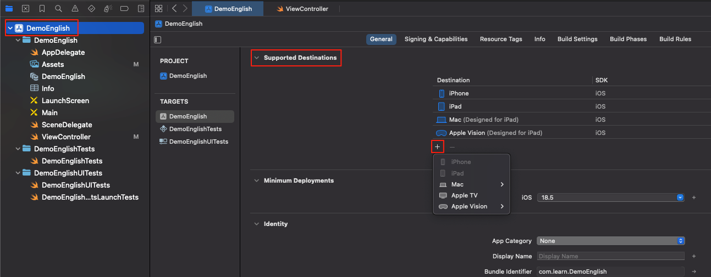
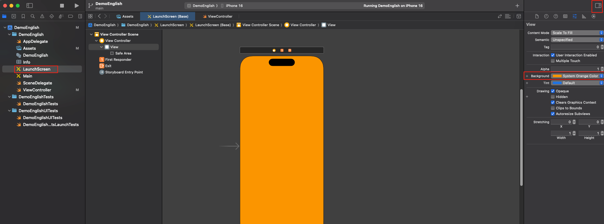

## 📚  《ios 设置项目属性》

- Supported Destinations **设置需要支持的平台**

 

- Minimum Deployments **设置版本号**

- Identity **识别设置**

1. App Category **应用类别**
2. Display Name **应用名称**
3. Bundle Identifier **应用标识**
4. Version **版本号**
5. Build **编译号**

- Deployment Info **设置设备朝向**
1. Status Bar Styly **界面风格**，可选暗黑和明亮两种模式

- App lcons and Launch Screen **启动画面**
1. Launch Screen File **静态画面文件**，LaunchScreen.storyboard、Main.storyboard
2. LaunchScreen.storyboard  **故事版界面**

 
